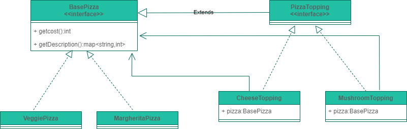

# LLD Of Pizza Shop Billing System

## Requirements
* There would be base pizzas and toppings with respective prices
* customers are allowed to have any number of toppings on base pizza including zero
* customer should be charged for each topping serving
* topping alone cannot be brought
* return total bill with items brought

## Class Diagram
